# 🐳 Design Dock

Design Dock is a full-stack e-commerce platform built with Django that allows users to browse, purchase, and manage premium digital and physical design products. The application provides secure payments, user authentication, admin product management, and a responsive user experience across devices.

- **Live site:** https://design-dock-9a1c5bd13893.herokuapp.com  
- **Repository:** https://github.com/chazeldred55-code/design-dock  

---

## Table of Contents

1. [Project Overview](#1-project-overview)  
2. [User Experience (UX)](#2-user-experience-ux)  
3. [Design & UX Decisions](#3-design--ux-decisions)  
4. [Agile Methodology](#4-agile-methodology)  
5. [Features](#5-features)  
6. [Future Features](#6-future-features)  
7. [Database Design](#7-database-design)  
8. [Technologies Used](#8-technologies-used)  
9. [Testing](#9-testing)  
10. [Deployment](#10-deployment)
11. [Responsive_Design](#11-responsive-design)  
12. [Wireframes](#12-wireframes)
---

## 1. Project Overview

### 🧠 Purpose
Design Dock is a Django-based e-commerce platform that enables users to browse a structured product catalogue, manage a session-backed cart, and complete purchases through an integrated payment flow.

### ⚙️ System Overview
The application follows a server-rendered architecture using Django templates and views, with a relational database managing products, categories, and orders.

Core flow:
1. Users browse products via the catalogue (`/products/`)
2. Products can be added to a session-based cart
3. Cart state is updated dynamically across requests
4. Users proceed to checkout and complete payment
5. Orders are created and persisted post-payment

### 🎯 Site Owner Goals
- Maintain a structured product catalogue via admin panel
- Enable reliable checkout and order processing
- Provide a clean, responsive storefront experience

### 👤 User Goals
- Discover and browse products efficiently
- Add/remove items from cart with clear feedback
- Complete purchases securely with minimal friction
---

# 2. User Experience (UX)

### 🎯 Strategy Plane

#### Target Audience
- Designers  
- Students  
- Creative professionals  
- Small business owners  

#### User Stories

**👤 Site User**
- Browse products  
- Filter products by category  
- Search for products  
- Add items to bag  
- Securely purchase items  
- View order history  

**👑 Site Owner**
- Add products  
- Edit products  
- Delete products  
- Manage categories  

---

# 3. Design & UX Decisions

### 🎨 Visual Identity
A minimal black and white branding style was chosen to reflect a professional, modern design-focused platform. The dark-accent approach keeps attention on product visuals while maintaining strong contrast for accessibility.

### 🧱 Layout & Structure
A card-based grid layout was implemented for product listings to maintain consistency, improve scanability, and support responsive scaling across breakpoints using Bootstrap’s mobile-first grid system.

### 🧭 Navigation Design
Navigation was simplified to reduce cognitive load. Primary navigation focuses on templates, the account dropdown separates user actions, and the shopping bag remains visible for quick access.

### 🛒 Checkout Flow
The checkout process was designed to be linear and distraction-free to reduce drop-off and support fast transaction completion. Stripe PaymentIntent was implemented for secure and modern payment handling.

### ♿ Accessibility Considerations
- Semantic heading structure  
- ARIA roles for dropdown navigation  
- High contrast text  
- Responsive layout  
- Lighthouse accessibility audits performed  

---

# 4. Agile Methodology

A GitHub Projects board was used to track user stories, development tasks, bugs, and feature implementation. Development followed an iterative approach with incremental feature builds and clear commit messages.
## Agile Development Process

Development followed an iterative Agile methodology using GitHub Projects.

User stories were created as issues and prioritised using MoSCoW (Must, Should, Could, Won’t).

Core e-commerce functionality was implemented first (Must Have), followed by usability enhancements.

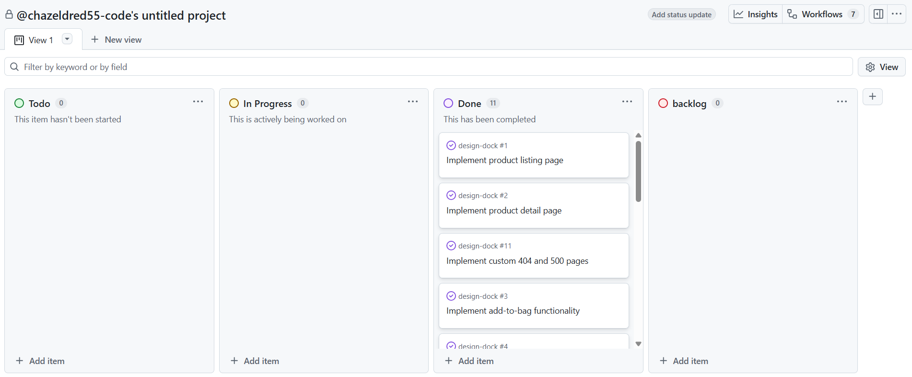

### Development Iterations

Iteration 1 – Core Product Display
- Product listing
- Product detail

Iteration 2 – E-commerce Flow
- Add to bag
- Shopping bag
- Stripe checkout

Iteration 3 – Admin & Deployment
- Product CRUD
- Profile
- Error pages

# 5. Features

### 🔐 Authentication
- Register  
- Login  
- Logout  
- Profile management  

### 🛍 Product Browsing
- Category filtering  
- Search functionality  
- Product detail view  

### 🛒 Shopping Bag
- Add items  
- Update quantity  
- Remove items  
- View totals  

### 💳 Secure Checkout
- Stripe PaymentIntent integration  
- Order confirmation  
- Webhook handling  

### 🛠 Admin Controls
- Add product  
- Edit product  
- Delete product  
- Manage categories  

### 📱 Responsive Design
- Mobile-first layout  
- Bootstrap grid  
- Optimised layouts  

---

# 6. Future Features

- Wishlist functionality  
- Product reviews  
- Discount codes  
- Email order confirmation  
- Stock tracking dashboard  
- Subscription-based design packs  

---

# 7. Database Design

### Models Used
- User (Django AllAuth)  
- Product  
- Category  
- Order  
- OrderLineItem  
- UserProfile  

### Relationships
- Product → Category (ForeignKey)  
- Order → UserProfile (ForeignKey)  
- OrderLineItem → Product (ForeignKey)  
- OrderLineItem → Order (ForeignKey)  

---

# 8. Technologies Used

### Backend
- Python  
- Django  

### Database
- SQLite (development)  
- PostgreSQL (production)  

### Payments
- Stripe API  

### Frontend
- HTML5  
- CSS3  
- Bootstrap  
- JavaScript  

### Deployment & Storage
- Heroku  
- AWS S3  
- GitHub  

---

# 9. Testing

## Manual Testing

## Manual Testing

| Feature | Test Performed | Expected Result | Result |
|----------|----------------|----------------|--------|
| Add to Bag | Clicked “Add to Bag” on product page | Product added to bag | ✅ Pass |
| Update Quantity | Increased quantity in bag | Quantity updated correctly | ✅ Pass |
| Remove Item | Clicked remove button | Item removed from bag | ✅ Pass |
| Secure Checkout | Completed Stripe payment | Order processed & confirmation shown | ✅ Pass |
| Admin Product CRUD | Created/Edited/Deleted product in admin | Product updated in database | ✅ Pass |

### Manual Testing Evidence

The following screenshots demonstrate successful manual testing of core functionality:

#### 🛍 Add to Bag
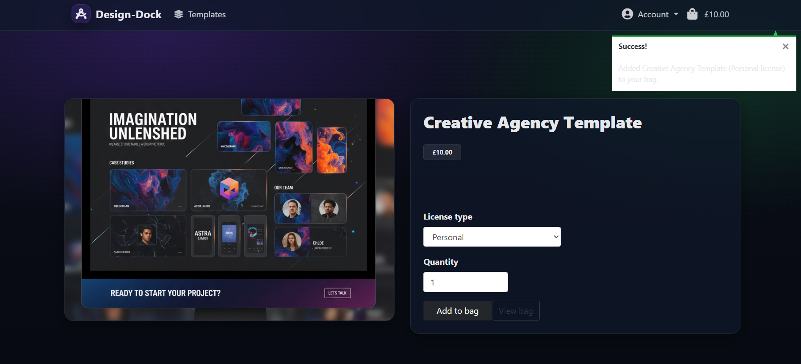

#### 🔄 Update Quantity
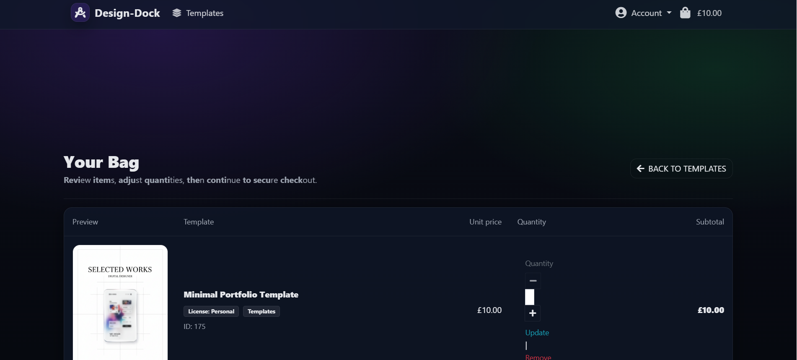

#### ❌ Remove Item
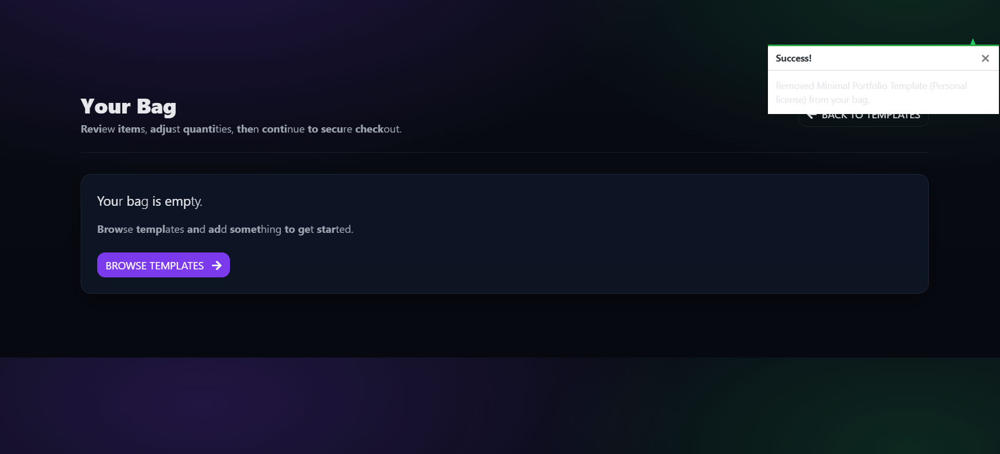

#### 💳 Checkout Success
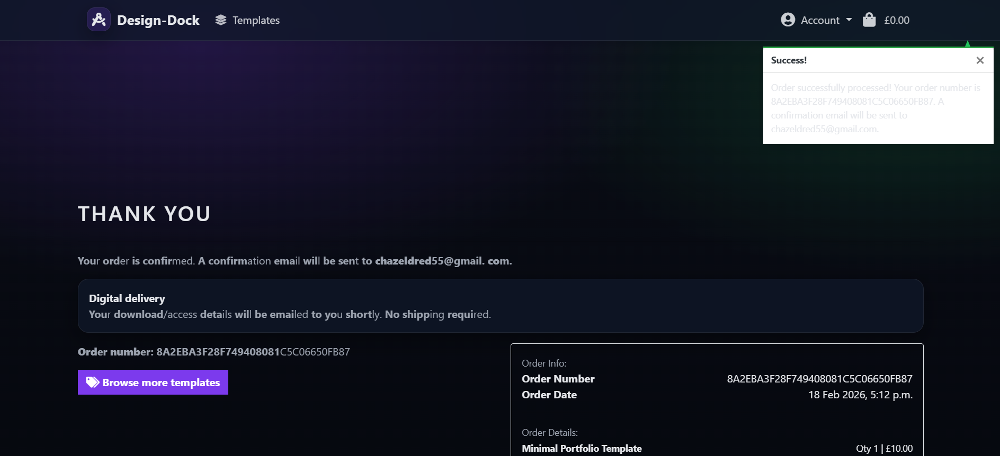

#### 🔔 Webhook Confirmation
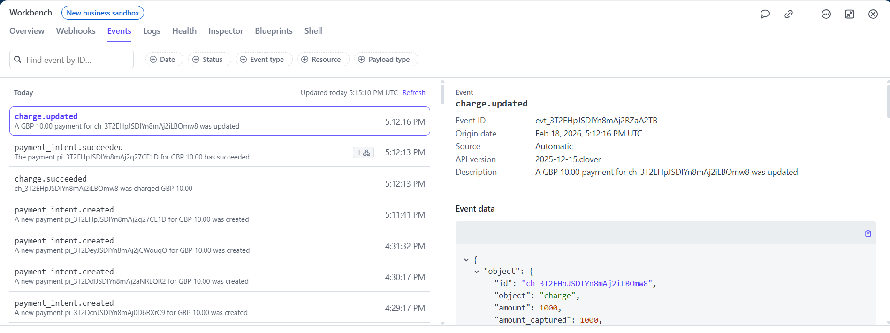

#### 🛠 Admin – Add Product
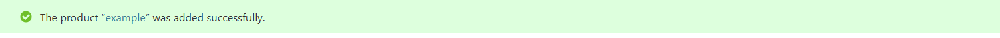

#### ✏ Admin – Edit Product
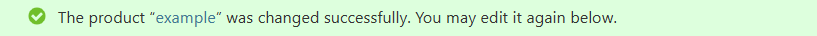

#### 🗑 Admin – Delete Product
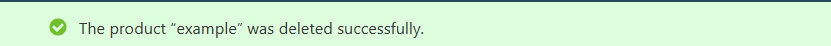


## Lighthouse Testing

Lighthouse audits were run in Chrome DevTools with cache disabled.

#### Home – Mobile
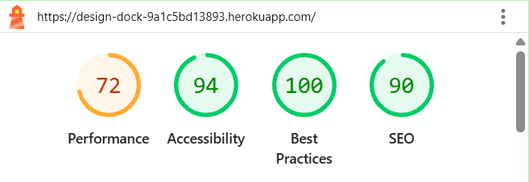

#### Home – Desktop
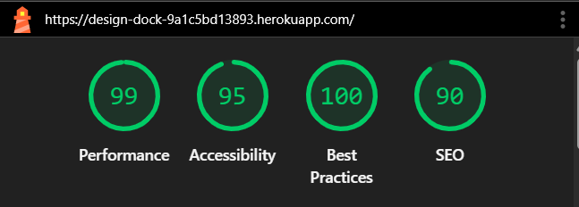

#### Products – Mobile
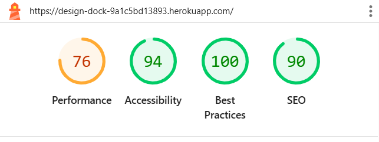

#### Products – Desktop
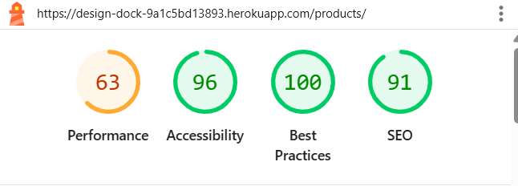

#### Bag – Mobile
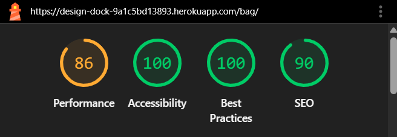

#### Bag – Desktop
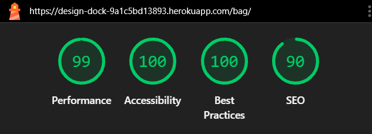

#### Checkout – Mobile
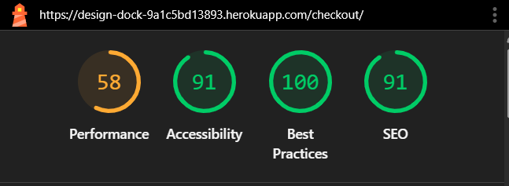

#### Checkout – Desktop
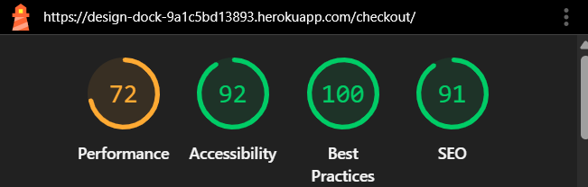

## HTML Validation (W3C)

#### Home
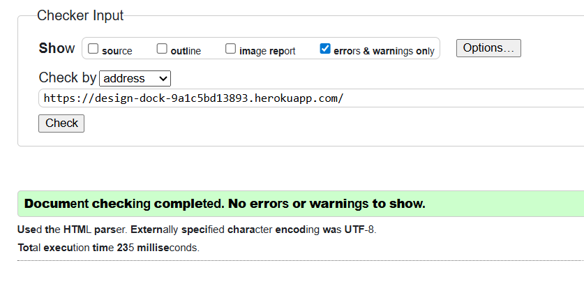

#### Products
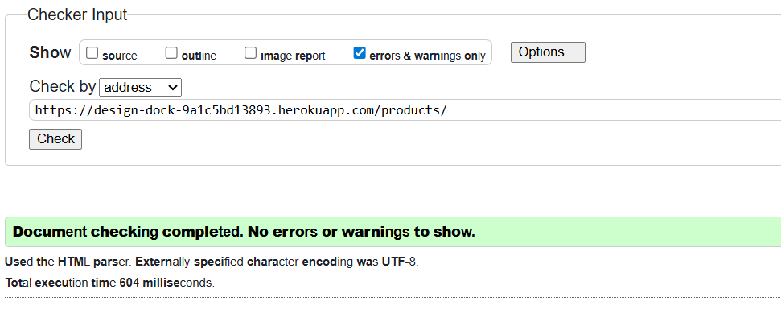

#### Bag
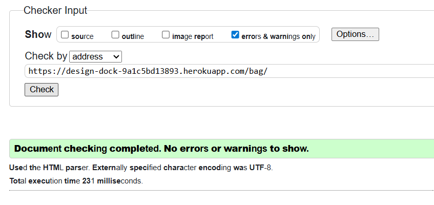

#### Checkout
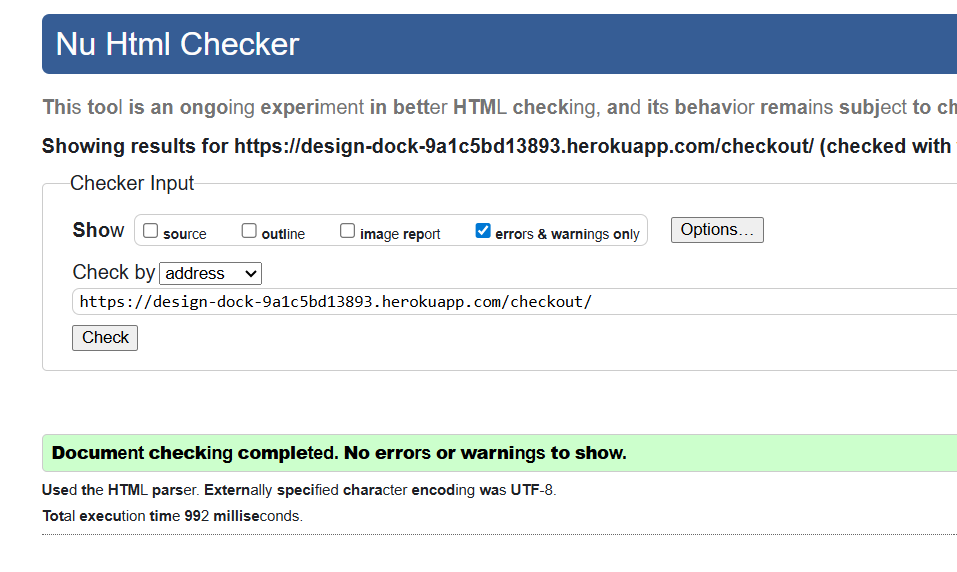


### Bug: Category filtering not working

**Issue:**  
Category buttons were visible but did not trigger filtering.

**Root Cause:**  
- Category links were missing query parameters  
- UI was placed outside Django ``  
- Categories variable was overwritten in the view

**Fix:**  
- Implemented query-based filtering (`?category=...`)  
- Moved UI inside correct template block  
- Refactored variable naming to avoid collisions
---

# 10. Deployment


This project can be run locally for development and deployed to Heroku for production.

---

### 10.1 Forking the Repository

1. Log in to GitHub.
2. Navigate to the Design Dock repository.
3. Click the **Fork** button in the top right.
4. Select your account to create a copy.

---

### 10.2 Cloning the Repository

1. Open your forked repository.
2. Click **Code** and copy the HTTPS URL.
3. In your terminal run:

```bash
git clone https://github.com/chazeldred55-code/design-dock.git
cd design-dock
```

---

### 10.3 Local Development Setup

#### Prerequisites

- Python 3.11+
- pip
- Git
- Stripe account (for payment testing)
- AWS account (if using S3)

#### Create a Virtual Environment

```bash
python -m venv .venv
```

Activate:

Windows:
```bash
.venv\Scripts\activate
```

Mac/Linux:
```bash
source .venv/bin/activate
```

#### Install Dependencies

```bash
pip install -r requirements.txt
```

#### Environment Variables

Create a `.env` file in the project root (same level as `manage.py`).

Example:

```env
SECRET_KEY=your-secret-key
DEBUG=True
ALLOWED_HOSTS=127.0.0.1,localhost

STRIPE_PUBLIC_KEY=pk_test_...
STRIPE_SECRET_KEY=sk_test_...
STRIPE_WH_SECRET=whsec_...
```

⚠️ Never commit your `.env` file.

#### Apply Migrations

```bash
python manage.py migrate
```

#### Create Superuser

```bash
python manage.py createsuperuser
```

#### Run the Development Server

```bash
python manage.py runserver
```

---

### 10.4 Heroku Deployment

This project is deployed using Heroku with PostgreSQL.

#### Create the Heroku App

1. Log into Heroku.
2. Click **New → Create New App**.
3. Choose a region.
4. Add **Heroku Postgres** under Resources.

#### Set Config Vars

Go to **Settings → Reveal Config Vars** and add:

```
SECRET_KEY
DEBUG=False
ALLOWED_HOSTS=design-dock-9a1c5bd13893.herokuapp.com
DATABASE_URL
STRIPE_PUBLIC_KEY
STRIPE_SECRET_KEY
STRIPE_WH_SECRET
```

If using AWS S3:

```
USE_AWS=True
AWS_ACCESS_KEY_ID
AWS_SECRET_ACCESS_KEY
AWS_STORAGE_BUCKET_NAME
AWS_S3_REGION_NAME
```

#### Deploy via GitHub

1. Open the **Deploy** tab.
2. Connect GitHub.
3. Select the repository `design-dock`.
4. Choose the `main` branch.
5. Click **Deploy Branch**.

#### Run Migrations in Production

```bash
heroku run python manage.py migrate -a design-dock-9a1c5bd13893
```

Create admin user:

```bash
heroku run python manage.py createsuperuser -a design-dock-9a1c5bd13893
```

---

### 10.5 Static & Media Files (AWS S3)

If `USE_AWS=True`, static and media files are stored in an AWS S3 bucket.

Setup summary:

- Create S3 bucket
- Enable public read access for static files
- Add AWS credentials to Heroku Config Vars
- Ensure bucket region matches Django settings
- `collectstatic` runs automatically during deployment

---

### 10.6 Stripe Webhooks (Production)

1. Go to **Stripe Dashboard → Developers → Webhooks**
2. Add endpoint:

```
https://design-dock-9a1c5bd13893.herokuapp.com/checkout/wh/
```

3. Select:
   - `payment_intent.succeeded`
   - `payment_intent.payment_failed`

4. Add the webhook signing secret to Heroku:

```
STRIPE_WH_SECRET=whsec_...
```

---

### 10.7 Production Checklist

- [ ] Live site loads without errors
- [ ] Static files load correctly
- [ ] Stripe test payment completes successfully
- [ ] Admin panel accessible
- [ ] DEBUG=False in production
- [ ] No console errors
# 11 Responsive Design
## Screenshots

### Product Listing Page
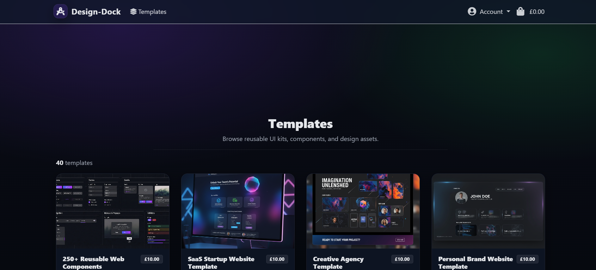

### Product Detail Page
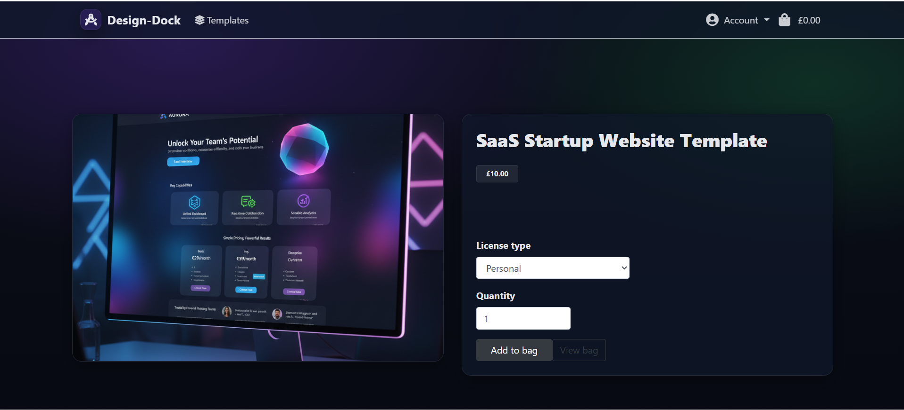

### Shopping Bag
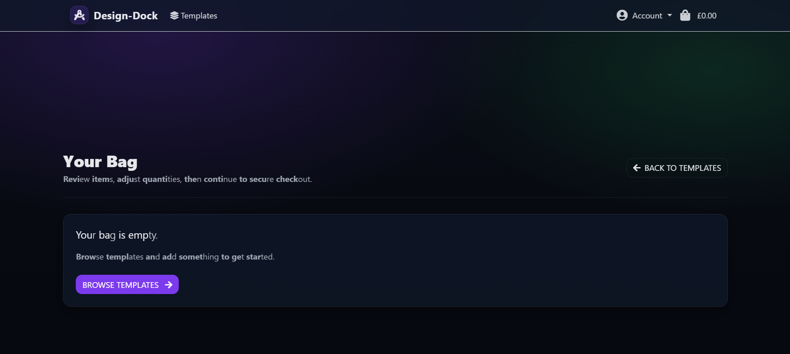

### Checkout Page
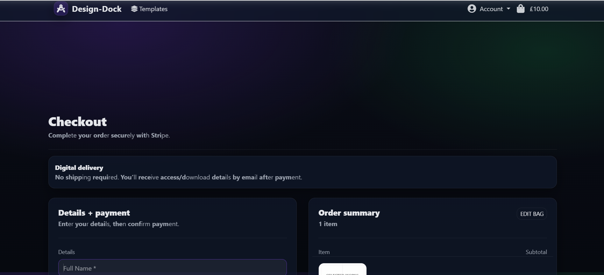

### Admin Panel
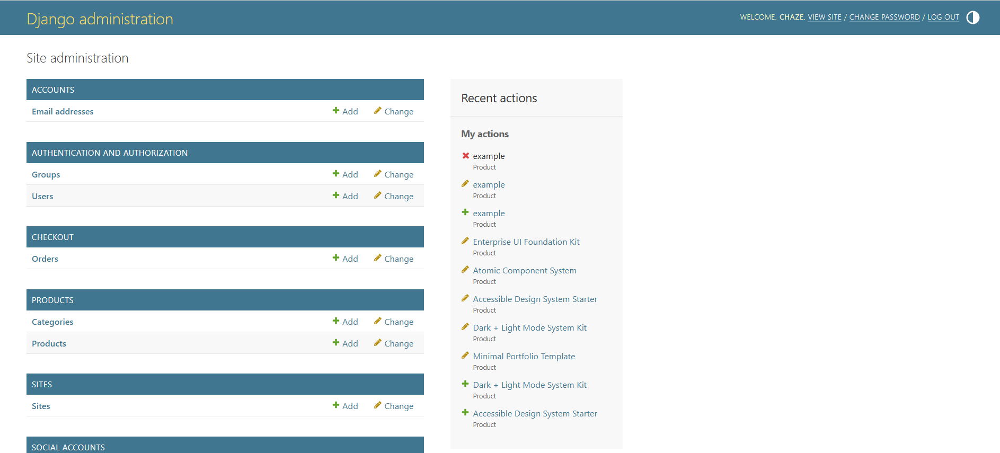

---

## Responsive Design

The website has been fully tested across multiple screen sizes to ensure a seamless user experience on desktop, tablet, and mobile devices.

### Desktop View (992px and above)

- Multi-column product grid layout  
- Full navigation bar displayed  
- Side-by-side checkout form layout  
- Optimised spacing for large screens  

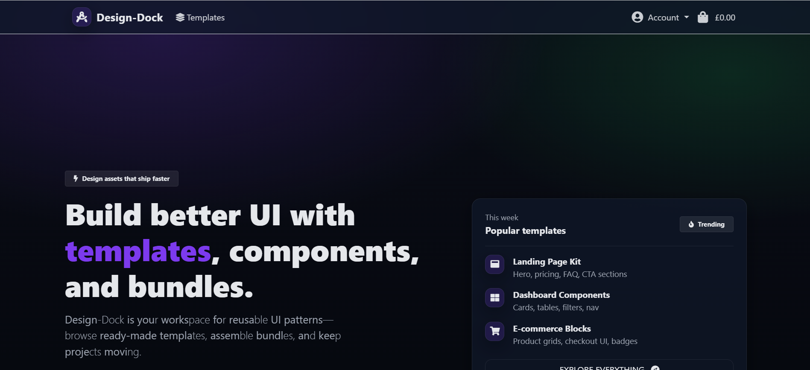

---

### Tablet View (768px – 991px)

- Reduced product grid columns  
- Adjusted spacing and margins  
- Optimised touch targets  
- Navigation adapted for medium screens  

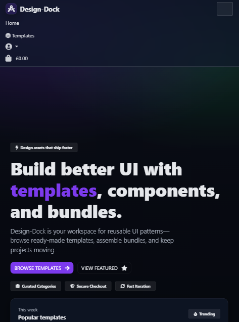

---

### Mobile View (767px and below)

- Single-column layout  
- Collapsible mobile navigation menu  
- Full-width buttons for accessibility  
- Stacked checkout form layout  
- Optimised for touch interaction  

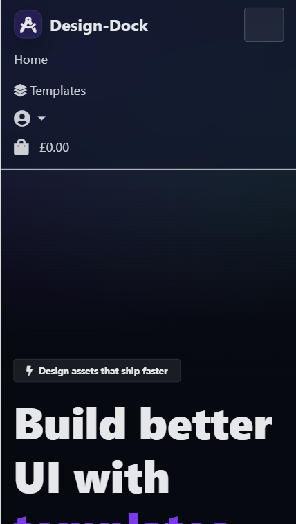

# 12. Wireframes

Wireframes were created during the planning phase to define layout structure, user flow, and responsive behaviour before development began. Low-fidelity mockups were produced to focus on functionality and layout before styling and development.

All wireframes are stored in:

`documentation/wireframes/`

---

### 🏠 Home Page

**Desktop**
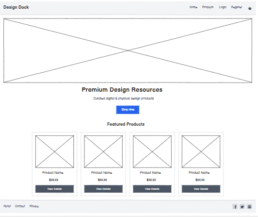

**Mobile**
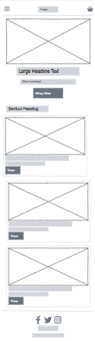

---

### 🛍️ Products Page

**Desktop**
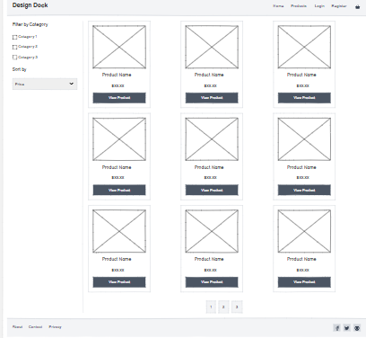

**Mobile**
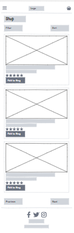

---

### 📦 Product Detail Page

**Desktop**
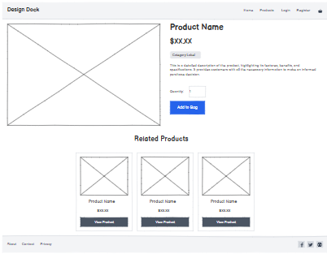

**Mobile**
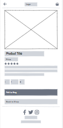

---

### 🛒 Shopping Bag Page

**Desktop**
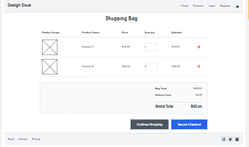

**Mobile**
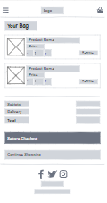

---

### 💳 Checkout Page

**Desktop**


**Mobile**
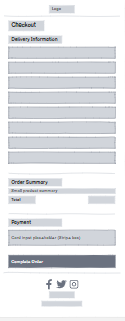

---

### ✅ Checkout Success Page
**Mobile**
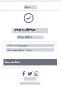

**Desktop**
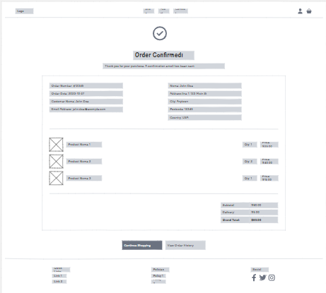
---

### 👤 Profile Page

**Desktop**
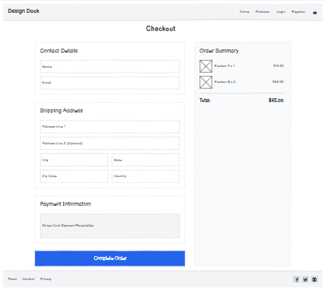

**Mobile**
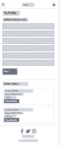

---

