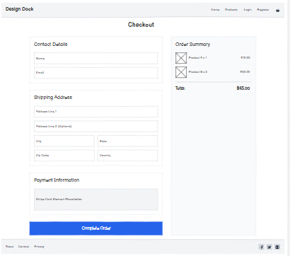

# 🐳 Design Dock

Design Dock is a full-stack e-commerce platform built with Django that allows users to browse, purchase, and manage premium digital and physical design products. The application provides secure payments, user authentication, admin product management, and a responsive user experience across devices.

- **Live site:** https://design-dock-9a1c5bd13893.herokuapp.com  
- **Repository:** https://github.com/chazeldred55-code/design-dock  

---

## Table of Contents

1. [Project Overview](#1-project-overview)
2. [User Experience (UX)](#2-user-experience-ux)
3. [Agile Methodology](#3-agile-methodology)
4. [Features](#4-features)
5. [Future Features](#5-future-features)
6. [Database Design](#6-database-design)
7. [Technologies Used](#7-technologies-used)
8. [Testing](#8-testing)
9. [Deployment](#9-deployment)

---

## 1. Project Overview

### 🧠 Purpose
Design Dock was created to provide designers and creatives with a curated marketplace for design resources and merchandise.

### 🎯 Site Owner Goals
- Sell design-related products
- Manage inventory and categories
- Process secure payments
- Provide a professional e-commerce experience

### 👤 User Goals
- Browse products
- Filter and search items
- Add products to a shopping bag
- Securely checkout
- Manage account details and view order history

---

## 2. User Experience (UX)

### 🎯 Strategy Plane

#### Target Audience
- Designers
- Students
- Creative professionals
- Small business owners

#### User Stories

**👤 Site User**
- As a user, I want to browse products so I can find something I like.
- As a user, I want to filter products by category.
- As a user, I want to search for products.
- As a user, I want to add items to my bag.
- As a user, I want to securely purchase items.
- As a user, I want to create an account and view order history.

**👑 Site Owner (Admin)**
- As an admin, I want to add products.
- As an admin, I want to edit products.
- As an admin, I want to delete products.
- As an admin, I want to manage product categories.

---

### 🗂 Scope Plane

#### Core Requirements Implemented
- ✅ CRUD functionality
- ✅ Stripe payments
- ✅ User authentication
- ✅ Admin product management
- ✅ Responsive design
- ✅ Deployment to Heroku
- ✅ Testing documented

---

### 🏗 Structure Plane

#### Navigation Structure
- Home
- Products
- Product Detail
- Shopping Bag
- Checkout
- Profile
- Admin Panel

---

### 🖌 Skeleton Plane

Wireframes were created for:
- Home page
- Product listing
- Product detail
- Bag
- Checkout
- Profile

📌 **Wireframes:**  

- Home Wireframe: 
- Products Wireframe: 
- Product Detail Wireframe: 
- Bag Wireframe: 
- Checkout Wireframe: 
- Profile Wireframe: 


---

### 🎨 Surface Plane

Design Dock uses:
- Minimal black/white branding
- Clean layout
- Clear CTA buttons
- Consistent typography
- Responsive Bootstrap grid

---

## 3. Agile Methodology

A GitHub Projects board was used to track:
- User stories
- Development tasks
- Bugs
- Feature implementation

Project development approach:
- Iterative development
- Feature branches where appropriate
- Regular commits
- Clear commit messages

---

## 4. Features

### 🔐 Authentication
- Register
- Login
- Logout
- Profile management

### 🛍 Product Browsing
- Category filtering
- Search functionality
- Product detail view

### 🛒 Shopping Bag
- Add items
- Update quantity
- Remove items
- View totals

### 💳 Secure Checkout
- Stripe payment integration (PaymentIntent)
- Order confirmation
- Webhook handling

### 🛠 Admin Controls
- Add product
- Edit product
- Delete product
- Manage categories

### 📱 Responsive Design
- Mobile-first layout
- Bootstrap grid
- Optimised layouts

---

## 5. Future Features
- Wishlist functionality
- Product reviews
- Discount codes
- Email order confirmation
- Stock tracking dashboard
- Subscription-based design packs

---

## 6. Database Design

### Models Used
- User (Django AllAuth)
- Product
- Category
- Order
- OrderLineItem
- UserProfile

### Relationships
- Product → Category (**ForeignKey**)
- Order → UserProfile (**ForeignKey**)
- OrderLineItem → Product (**ForeignKey**)
- OrderLineItem → Order (**ForeignKey**)

📌 _Optional improvement:_ include an ERD diagram image here.

---

## 7. Technologies Used

### Backend
- Python
- Django

### Database
- SQLite (development)
- PostgreSQL (production)

### Payments
- Stripe API

### Frontend
- HTML5
- CSS3
- Bootstrap
- JavaScript

### Deployment & Storage
- Heroku
- AWS S3 (static/media)
- GitHub

---

## 8. Testing

### Manual Testing

| Feature | Expected Result | Pass |
|--------|------------------|------|
| Add to bag | Item added correctly | ✅ |
| Update quantity | Quantity updates | ✅ |
| Remove item | Item removed | ✅ |
| Stripe payment | Payment succeeds | ✅ |
| Webhook | Order confirmed | ✅ |
| Admin CRUD | Product changes persist | ✅ |

### Validation / Quality
- HTML validated via W3C (no critical issues)
- CSS validated via W3C (no critical issues)
- Python linting via flake8
- Lighthouse testing (no critical errors remain)
### Light house testing

### Lighthouse Testing

#### Home – Mobile


#### Home – Desktop


#### Products – Mobile


#### Products – Desktop


#### Bag – Mobile


#### Bag – Desktop


#### Checkout – Mobile


#### Checkout – Desktop

### HTML Validation (W3C)

#### Home


#### Products


#### Bag


#### Checkout


---
## 9. Deployment

This project can be run locally for development and deployed to Heroku for production.

---

### 9.1 Forking the Repository

1. Log in to GitHub.
2. Navigate to the Design Dock repository.
3. Click the **Fork** button in the top right.
4. Select your account to create a copy.

---

### 9.2 Cloning the Repository

1. Open your forked repository.
2. Click **Code** and copy the HTTPS URL.
3. In your terminal run:

```bash
git clone https://github.com/chazeldred55-code/design-dock.git
cd design-dock
```

---

### 9.3 Local Development Setup

#### Prerequisites

- Python 3.11+
- pip
- Git
- Stripe account (for payment testing)
- AWS account (if using S3)

#### Create a Virtual Environment

```bash
python -m venv .venv
```

Activate:

Windows:
```bash
.venv\Scripts\activate
```

Mac/Linux:
```bash
source .venv/bin/activate
```

#### Install Dependencies

```bash
pip install -r requirements.txt
```

#### Environment Variables

Create a `.env` file in the project root (same level as `manage.py`).

Example:

```env
SECRET_KEY=your-secret-key
DEBUG=True
ALLOWED_HOSTS=127.0.0.1,localhost

STRIPE_PUBLIC_KEY=pk_test_...
STRIPE_SECRET_KEY=sk_test_...
STRIPE_WH_SECRET=whsec_...
```

⚠️ Never commit your `.env` file.

#### Apply Migrations

```bash
python manage.py migrate
```

#### Create Superuser

```bash
python manage.py createsuperuser
```

#### Run the Development Server

```bash
python manage.py runserver
```

---

### 9.4 Heroku Deployment

This project is deployed using Heroku with PostgreSQL.

#### Create the Heroku App

1. Log into Heroku.
2. Click **New → Create New App**.
3. Choose a region.
4. Add **Heroku Postgres** under Resources.

#### Set Config Vars

Go to **Settings → Reveal Config Vars** and add:

```
SECRET_KEY
DEBUG=False
ALLOWED_HOSTS=design-dock-9a1c5bd13893.herokuapp.com
DATABASE_URL
STRIPE_PUBLIC_KEY
STRIPE_SECRET_KEY
STRIPE_WH_SECRET
```

If using AWS S3:

```
USE_AWS=True
AWS_ACCESS_KEY_ID
AWS_SECRET_ACCESS_KEY
AWS_STORAGE_BUCKET_NAME
AWS_S3_REGION_NAME
```

#### Deploy via GitHub

1. Open the **Deploy** tab.
2. Connect GitHub.
3. Select the repository `design-dock`.
4. Choose the `main` branch.
5. Click **Deploy Branch**.

#### Run Migrations in Production

```bash
heroku run python manage.py migrate -a design-dock-9a1c5bd13893
```

Create admin user:

```bash
heroku run python manage.py createsuperuser -a design-dock-9a1c5bd13893
```

---

### 9.5 Static & Media Files (AWS S3)

If `USE_AWS=True`, static and media files are stored in an AWS S3 bucket.

Setup summary:

- Create S3 bucket
- Enable public read access for static files
- Add AWS credentials to Heroku Config Vars
- Ensure bucket region matches Django settings
- `collectstatic` runs automatically during deployment

---

### 9.6 Stripe Webhooks (Production)

1. Go to **Stripe Dashboard → Developers → Webhooks**
2. Add endpoint:

```
https://design-dock-9a1c5bd13893.herokuapp.com/checkout/wh/
```

3. Select:
   - `payment_intent.succeeded`
   - `payment_intent.payment_failed`

4. Add the webhook signing secret to Heroku:

```
STRIPE_WH_SECRET=whsec_...
```

---

### 9.7 Production Checklist

- [ ] Live site loads without errors
- [ ] Static files load correctly
- [ ] Stripe test payment completes successfully
- [ ] Admin panel accessible
- [ ] DEBUG=False in production
- [ ] No console errors
